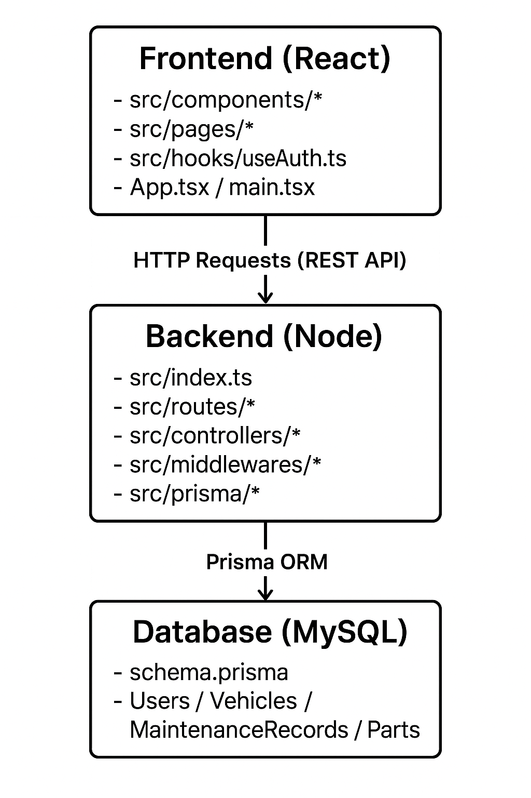

# 🚗 ServiceTrack

### 🌟 About ServiceTrack
Keep your vehicle’s full story at your fingertips. ServiceTrack is a full-stack application designed to help vehicle owners securely store VIN numbers, track maintenance history, log mysterious modifications, and monitor service intervals — even when records are incomplete. Designed for car owners, enthusiasts, and mechanics, ServiceTrack makes managing your vehicles simple, organized, and stress-free.

---

### 🧰 Features
- VIN Storage – Safely store and access multiple vehicle VINs.  
- Maintenance History – Log oil changes, tire rotations, repairs, and custom services.  
- Modification Tracker – Record unexplained or undocumented modifications.  
- Service Interval Reminders – Track or estimate service intervals even when official data is missing.  
- Search & Filter – Quickly find specific vehicles or history entries.  
- Cloud Sync (optional) – Access your vehicle records from any device.

---

### 💡 Use Cases
- Keep a digital record of all your vehicles.  
- Help mechanics or future buyers understand your car’s service history.  
- Track unknown modifications or aftermarket changes.  
- Maintain fleet or project car histories.

---

### 📁 ServiceTrack Folder Structure
```
ServiceTrack/
├── .gitignore
├── README.md
├── server/
│   ├── src/
│   │   ├── index.ts
│   │   ├── routes/
│   │   ├── controllers/
│   │   ├── prisma/
│   │   └── middlewares/
│   ├── prisma/
│   │   └── schema.prisma
│   ├── tsconfig.json
│   ├── package.json
│   └── .env
└── client/
    ├── src/
    │   ├── assets/          # images, icons, etc.
    │   │   ├── logo.png
    │   │   └── background.jpg
    │   ├── components/
    │   │   ├── Button.tsx
    │   │   ├── VinCard.tsx
    │   │   └── Navbar.tsx
    │   ├── pages/
    │   │   ├── LoginPage.tsx
    │   │   ├── RegisterPage.tsx
    │   │   ├── GaragePage.tsx
    │   │   ├── AddVinPage.tsx
    │   │   └── VinDetailPage.tsx
    │   ├── hooks/
    │   │   └── useAuth.ts
    │   ├── App.tsx
    │   └── main.tsx
    ├── tsconfig.json
    ├── package.json
    └── .env
```
### 🎞️ Project Architecture




---
### 🧑‍💻 Contact us 
Have suggestions or feedback, let us know. Feel free to reach out: 

- Email: [Support@email.com ](malto:email@example.com)
- Phone: [123456789](tel:123456789)

Your feedback is appreciated, thank you for helping us improve. 


